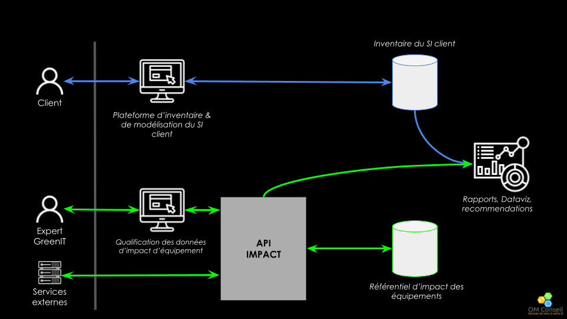

#Flux de données

Le système s'appuye sur deux flux de données principaux un flux de donnée d'inventaire du SI client et un flux de données d'impact environnmentale des équipements

### Flux de données d'impact des équipements

L'API IMPACT est la pierre angulaire de ce flux de données. Elle permet d'accéder au référentiel d'impact des équipements. Le référentiel est alimenté à travers le portail de qualification des données par un profil formé au greenIT. L'API peux également être utilisé en lecture par des services externes.

### Flux de données d'inventaire du SI client

Le SI des clients est inventorié et modélisé depuis la platforme de d'inventaire qui alimente la base de données d'inventairedu SI client.

### Liaison des deux flux de données

L'inventaire des équipements et ensuite consolider avec celui des impact pour obtenir l'impact du SI client sur différents axes d'analyses.